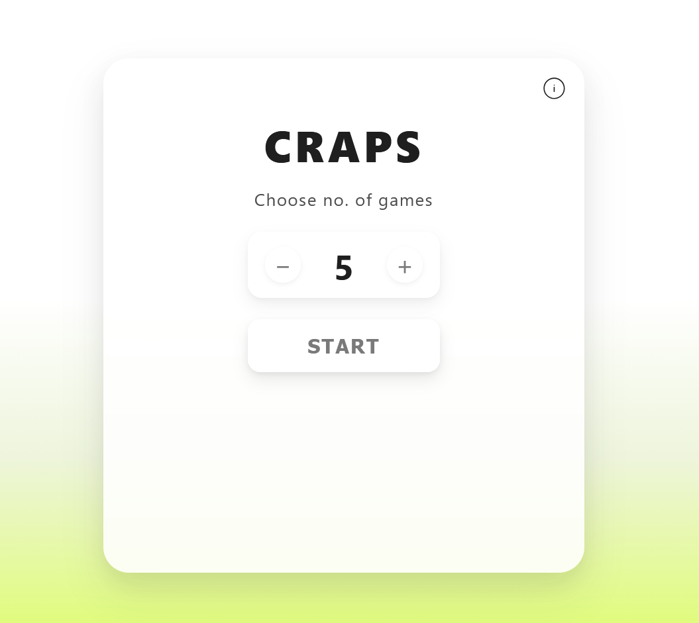
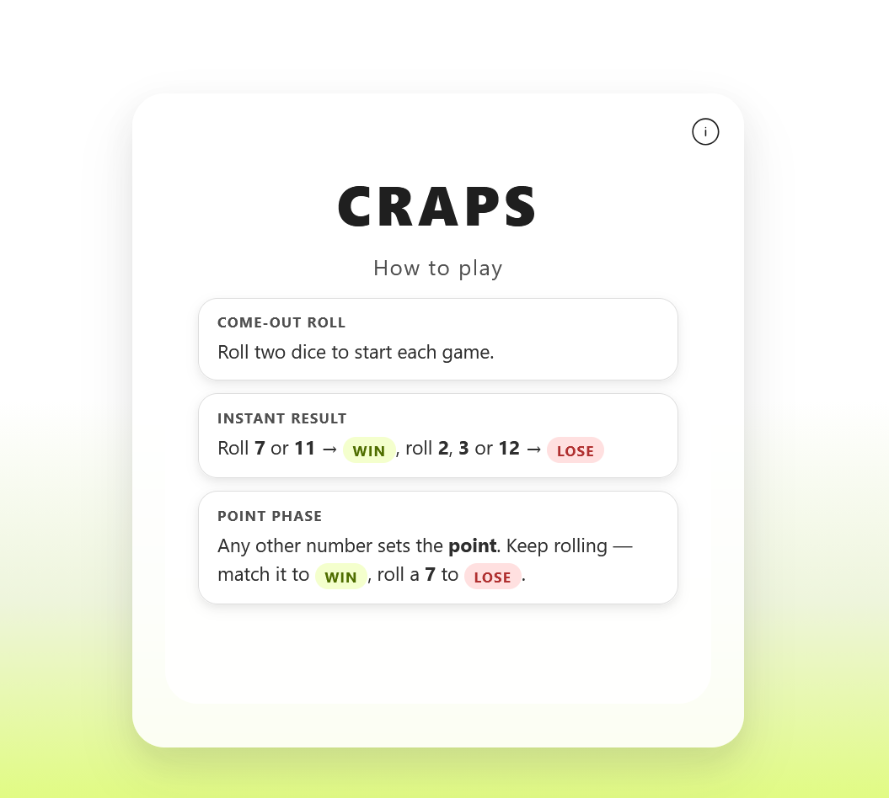
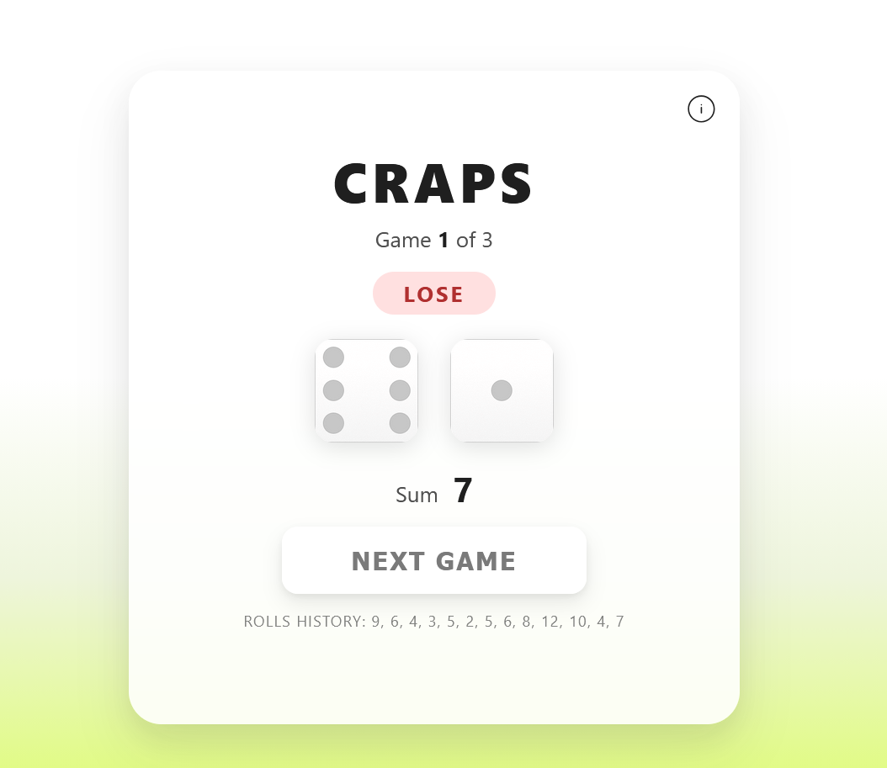
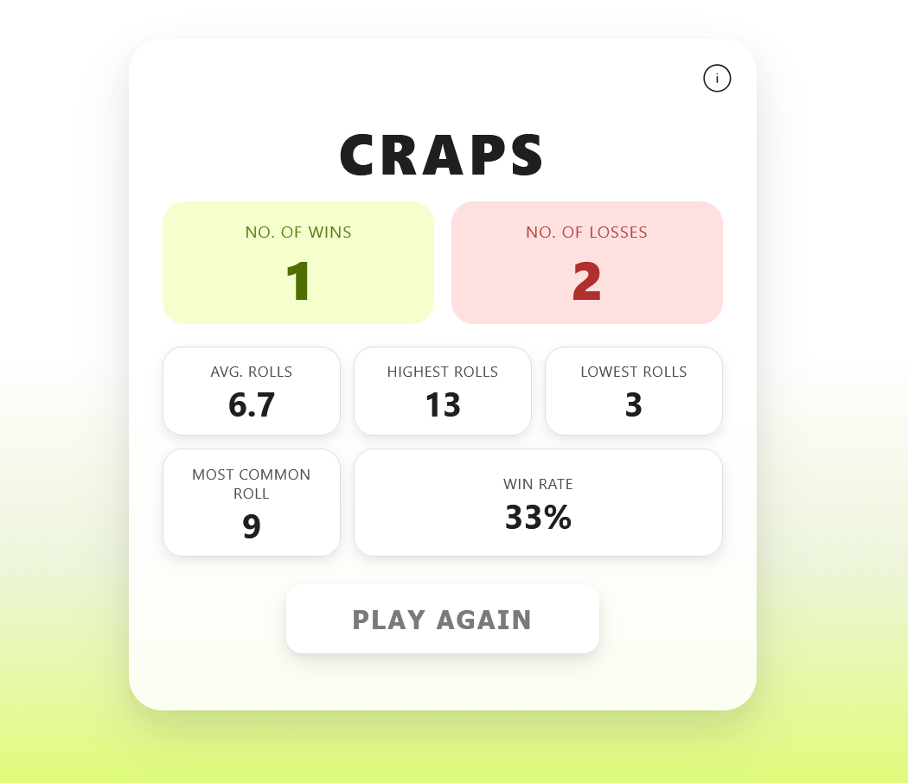

# Craps Game

A simple React and TypeScript application that simulates multiple games of Craps and displays key statistics about the results.

🎲 **Live demo:** [jm-go.github.io/craps](https://jm-go.github.io/craps/)

 

 

---

## How to Play

1. Choose the number of games to play (1-15).
2. Roll the dice - on the **come-out roll**:
   - Roll a **7 or 11** → instant win
   - Roll a **2, 3, or 12** → instant loss (craps)
   - Any other number becomes your **point**
3. In the **point phase**, keep rolling until you match your point (win) or roll a 7 (lose).
4. After all games are played, view your session statistics:
   - Number of wins and losses
   - Win rate
   - Average, highest, and lowest rolls per game
   - Most common roll

---

## Tech Stack

- React 19
- TypeScript
- Vite
- CSS
- Vitest + Testing Library

---

## Installation and Setup

1. **Clone the repository:**
   ```
   git clone https://github.com/jm-go/craps.git
   ```
2. **Navigate to the project directory:**
   ```
   cd craps
   ```
3. **Install dependencies:**
   ```
   npm install
   ```
4. **Start the development server:**
   ```
   npm run dev
   ```